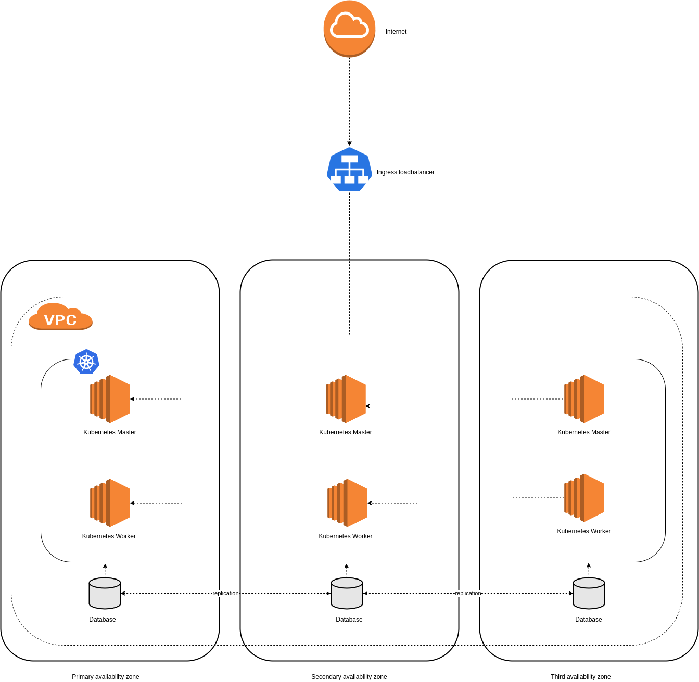

# Architecture

Architecture global Cluster Kubernetes

> I used aws icons but this architecture can be used on any cloud provider

> The schema is overly simplified to give an overview of the structure of the cluster

## Fault Tolerance

The goal of this architecture is to offer an High availability infrastructure to be able to run the application even if one or two availability zone are down.

> Availability zone are physicaly separated zone inside a cloud region (AWS : eu-west-1a, eu-west-1b, eu-west-1c)

A global multi zone VPC allow network communication between availability zone.

On each zone we can deploy multiple Kubernetes Node,  **each zone must contain one Kubernetes Master** (Node with control panel) and if possible one Kubernetes Worker.

If we want to keep some money, we can use only one master node, thereby the cluster will continue to handle traffic but you won't be able to push some modifications on the cluster and deployment state.

My advice if we want full high avalaibility is to use at least 6 nodes on 3 zones, with one master on each.

## Entrypoint Loadbalancer

On many cloud provider, an Ingress Loadbalancer is available and Integrated with Kubernetes.

**It's a good practices to use it instead of ClusterIP or NodePort.**

## Database

Even if we can deploy database on a Kubernetes cluster (StatefulSet), it could be a good idea to use an external services for this purpose, or use general server instance for this.

The reason is that kubernetes can change quickly the lifecycle of an application, and it can be a real problem for stateful application like database.
Even some task like backups, scaling or tuning could be harder due to containerization abstractions.

**My advices is, if it's possible, to use cloud managed services (RDS, CloudSQL) to have easier scaling or backup options.** 

## Observability

### Metrics
Prometheus is the tool to go to have metrics aggregation.
It can do service discovery and scraping on distant exporter.
The integration with kubernetes is really good and it can handle a LOT of metrics or targets.
It can also trigger alerting (Alertmanager)

Grafana has to be installed to offer visualisation over your prometheus metrics.

### Logs
Loki or ELK stack can be used for log aggregation and analysis.

My personal favorite is Loki with Promtail (Log forwarder), because it's extremely simple and can scale really well by storing log with an object storage (like S3).

Promtail is really well integrated with Kubernetes (Fluentd can be used aswell)

For visualisation you can use Grafana.

### Trace

Jaeger for trace aggregation and Tempo for trace storage.
Each tools have great integration with many language, and Tempo is really well integrated with Grafana.

## Developer desktop experience
> The goal is to be as close as possible to production

Multiple solutions can be used for developer experience.

We can use a local solution like Minikube (https://github.com/kubernetes/minikube)

which allow to run a local kubernetes instance.

One other solution is to create a dedicated cluster or namespace, for the dev team, allowing each dev to deploy their own infrastructure.

## CI / CD

Jenkins is the tool to go for CI / CD because of his robustess and great integration with a lot of services.

The workflow used could be GitOps: 

Push on branch feature/xxx
Image creation of feature/xxx
Image testing (Unit test, E2E)
Env feature/xxx created for testing purpose

On merge deletion of created env
Image deployment on master by manual step

The versionned code can contain application code and kubernetes deployment, allowing to have truly infrastructure as code.

## Backup strategy

For data related services, like database, the managed cloud service (RDS, CloudSQL) have features like hot backup available.

On a kubernetes level, a PRA should be made to backup ETCD database, and make a process to restore it, in case of failure (even with multimaster cluster)

Any tool can be used for backup purposes (restic, duplicity).

PersistentVolume should be backup aswell.

My advice on this is to follow the 3-2-1 backup strategy.

## Kubernetes access

Kubernetes allow access control for users.

Every env and application should be cut into namespace, allowing access on each.

Group should be created for each, and user added into it.
A sysadmin group have full access on the cluster for maintenance purposes.

Each group should have access only on his ressources, with RoleBinding.

project1-dev => namespace project1-dev
project1-devops => namespace project1-prod

ect...

## How would you handle application configuration ?

By default, you can handle configuration application in ConfigMaps, allowing to record it in the infrastructure code.

The problem with this, is that it could be hard to modify quickly the service configuration.

Service like Consul, can be used as a K-V Store, allowing to manage service configuration, and reload it on each change.

## What processes and tools do you plan to use in order to have a proper "Infrastructure As Code" approach

GitOps workflow, with git as a versionning tools, Jenkins for CI / CD, and maybe Terraform for Infrastructure purposes.

The goal is to apply infrastucture change on each merge on master branch, avoiding configuration drifting between the production env and versionned infrastructure.

## Would you recommend a full cloud approach ? Hybrid deployment ?

A full cloud approach is easier to use,on the condition that you use tool to not be Cloud locked (Like in AWS, or GCP)

Hybrid deployment otherwise could be interesting on the high availabilty level, allowing to put multiple project on multiple cloud provider.

Also data storage could be a condition to use full cloud or on premise approach, it has to be talked with the business. 

## How would you deploy stateful applications such as databases ? Would you have them within Kubernetes and if so how would you manage them ?

Stateful application like databases can be deploy within kubernetes with StatefulSet and PersistentVolumeClaim.

If you have to use database that are not well integrated with kubernetes, you have to use Kubernetes Operators, for database maintenance tasks.

I don't have enough experience in this area, that why my advice is to use managed services, or dedicated cluster for this purposes.